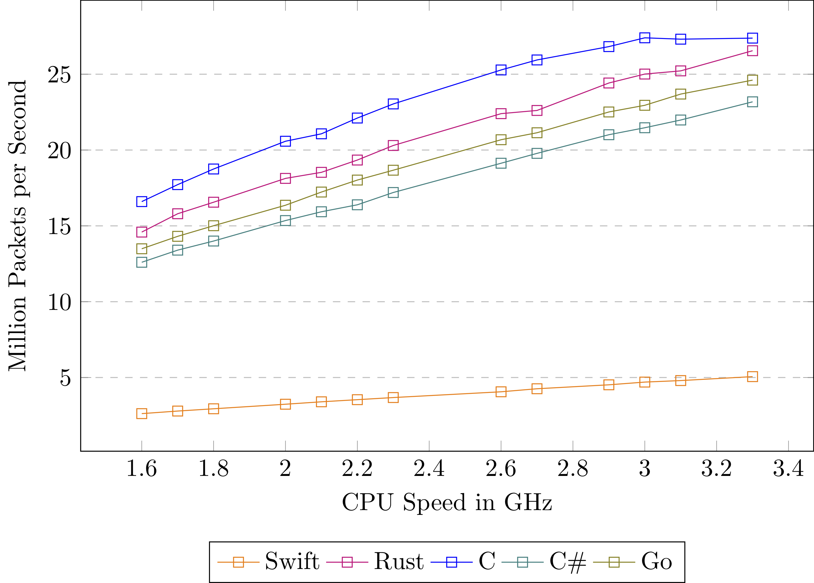
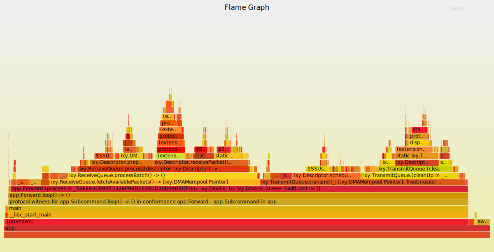
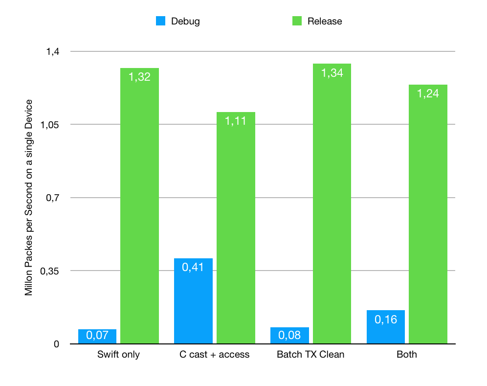
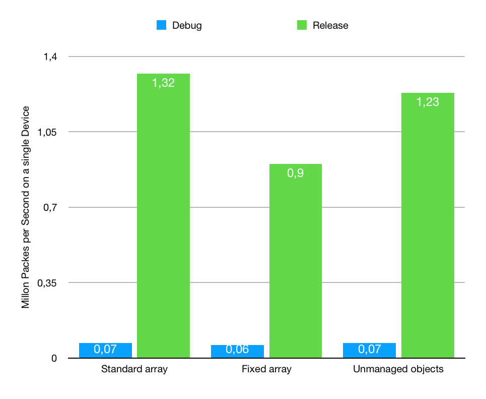

# Performance Evaluation

This performance evaluation aims to rank the Swift (4.2) version of the ixy user space network driver among the other currently existing implementations, as well as evaluating different performance impacts of Swift features.

## Comparison with other Implementations

While evaluating the Swift solution, the following were other implementations were available as of October 2018:

- ixy (C)
- ixy.rs (Rust)
- ixy.cs (C#)
- ixy.go (Go)
- ixy.swift (Swift)

The performance analysis was done on a Intel(R) Xeon(R) CPU E3-1230 V2 @ 3.30GHz with a X520 as Intel 82599 network interface controller.
All test runs were done using the `ixy-perf-measurements/` scripts for testing different cpu speeds.

For this comparison, the normal release Swift version without any C-Code was used. Unfortunately, Swift did not meet the performance anticipated when starting the project.

## Profiling the Swift Code

Due to the rather poor performance of the Swift version, `perf` was used to profile the code.
At the time of this evaluation, `perf` does not have native support for demangling Swift symbols, probably due to the unstable ABI, with a stable ABI announced for Swift 5.
However, the FlameGraph tool can be used to create an interactive SVG for the call tree and supports applying a custom demangle script, which makes debugging somewhat easier. The command used was

	perf script | \
	~/FlameGraph/stackcollapse-perf.pl | \
	swift-demangle | \
	~/FlameGraph/flamegraph.pl > ~/graph.svg`

The generated flame graph for the release version (above) shows a lot of time being spent in the retain/release calls, which are part of the Automated Reference Counting (ARC) of Swift.

For a more detailed flame graph, the debug build can be used. However, the debug version is very slow, transmitting only ~0.07 Mpps on each device.

The debug flame graph shown above contains all functions without any compiler optimizations. Here, most time is spent in arbitrary functions like integer conversions and memory access with masks applied (for example when checking if a packet descriptor is done). Therefore, C-implementations were introduced for this "bottleneck" functions. Switching between the two versions is done using compiler flags, so no additional code is executed when running the application.

The following measures are all for running the normal forward code with two devices, but only using the stats from one, as they are always 1/2 of the complete Mpps.  
When using the C stand-ins in the debug build, ~0.41 Mpps are sent, for the release build it's 1.11 Mpps. However, the normal swift release build is still faster.

Another performance improvement in the C version was due to a batch cleanup of old transmit descriptors, which was subsequently implemented in the swift version. This version performed best in release mode, but similar to the normal version in debug mode.

Combining both, the C stand-ins and the batch transmit cleanup, the debug version is somehow slower than just the C stand-in, but faster than the batch TX version. In release configuration, the performance is between only the batch tx cleanup and the C stand in version.

Another approach to improving the speed was to try changing the memory pool data structure. Three different approaches were evaluated: a simple array, a fixed size array and an array with unmanaged objects (which aren't reference counted in Swift).
Unfortunately, none of these alternatives were faster than the base version.

In conclusion, the current Swift version is far slower than the other. Although three different developers with Swift experience reviewed the code, no one found bottlenecks introduced by bad programming patterns. There is nearly no dynamic dispatch in critical sections and object allocations/copies are rarely created.
It might be possible that there are ways to improve the performance, but as the current code is quite standard Swift code, some solutions might offer better performance with the cost of having more C-like code without object-orientation.

### Used Versions

Commits used for this evaluation:

- ixy: `d89d68b37c7fd566c476843339cc2edd50f30609`
- ixy.swift: `9114052e0f0b337ea184a48cb0807f6c3167bccd`
- ixy.go: `4145aa81cf41349f0cdad1e666c547b0784230ef`
- ixy.cs: `484485b86214faca5a58ee6fb137335fdc7a346e`
- ixy.rs: `e19347162f17303d8e1c5517354538f99b2d5a9f`
- MoonGen: `1d13c8835f91560b7a1a44e66b850a915a6c3b1a`
- ixy-perf-measurements: `455388116f24d7052ccc02bce6447d20d927a4e6`